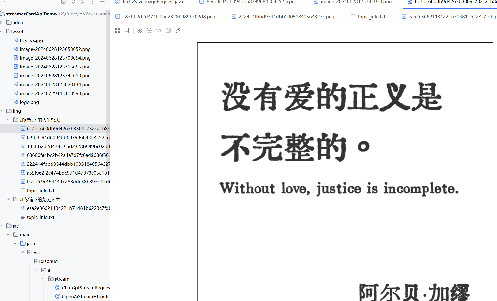

<h2 align="center">基于流光卡片API的完全自动化生成金句卡片解决方案</h2>

注意，本项目需要搭配流光卡片 API 这个开源项目一起使用：https://github.com/ygh3279799773/streamer-card

## 0、演示效果截图

只需要配置好 apiKey 和 uri，然后自动运行即可，会在这个项目内 img 文件夹下生成选题+金句卡片+标题+简介

## 1、如何使用

#### 1.1 安装环境+运行流光卡片 API

本项目基于 Java+maven，没有环境的朋友先安装一下环境

同时你还得会运行流光卡片 API：https://github.com/ygh3279799773/streamer-card

#### 1.2 配置 uri 和 apiKey

在 ConfigConstants 这个类中配置 url、apiKey、chatModel，这个 apiKey 中已经放了 50 元的使用额度

#### 1.3 先运行流光卡片 api

打开 BatchCreateMain 文件，然后运行就完事了

然后等待自动生成图文内容即可

## 2、🛸 在线生成精美卡片

- 国内版：https://textcard.shushiai.com/zh
- Google 插件地址：https://chromewebstore.google.com/detail/streamer-card-elegant-sha/cpfhabllndoodbfmidhlpafonbfjjigo?hl=zh-CN&utm_source=ext_sidebar
- 流光卡片开源 API：https://github.com/ygh3279799773/streamer-card

## 5、如果你对我们感兴趣

推特：@huangzh65903362

即刻：https://web.okjike.com/u/ec41d7d5-407d-4395-ac8a-bd0f04fb202c

小红书：https://www.xiaohongshu.com/user/profile/6220bf22000000001000e083

微信号：chatgpt0ai0041128

* 

